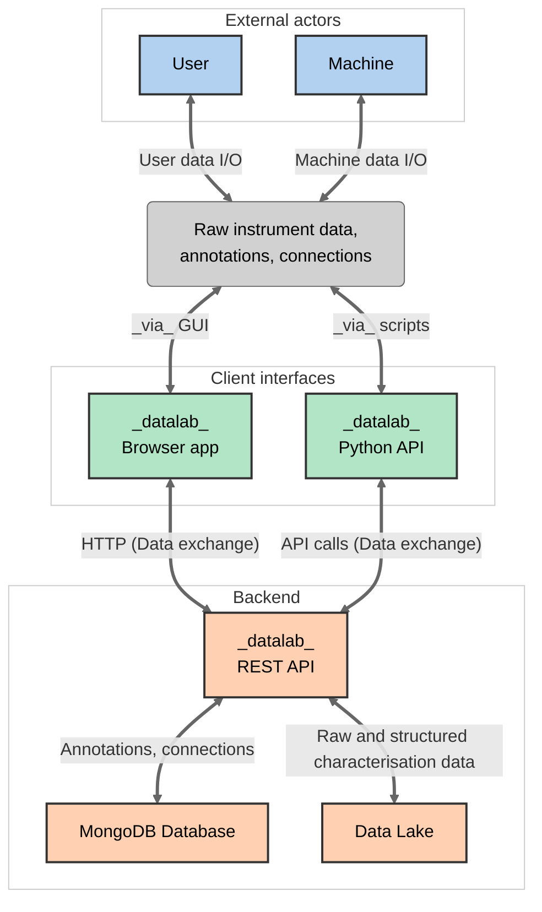

# 
<i>datalab</i>

_datalab_ is a user-friendly, open-source platform that can capture all the experimental data and metadata produced in a scientific lab, targeted (broadly) at materials chemistry but with customisability and extensability in mind.
_datalab_ records data and metadata securely and makes it accessible and reusable by both humans and machines _via_ the web UI and API, respectively.
_datalab_ can be self-hosted and managed deployments are also available.

You can try the demo deployment at [demo.datalab-org.io](https://demo.datalab-org.io/) and read the online documentation at [docs.datalab-org.io](https://docs.datalab-org.io) with release notes and changelog available on [GitHub](https://github.com/datalab-org/datalab/releases/) and [online](https://docs.datalab-org.io/en/latest/CHANGELOG).

Features:

* Capture and store sample and device metadata
* Connect and sync raw data directly and from laboratory instruments
* Built-in support for multiple characterisation techniques (XRD, NMR, echem, TEM, TGA, Mass Spec, Raman and more).
* Capture scientific context: store the graph of relationships between research objects.
* [Python API](https://github.com/datalab-org/datalab-api) for programmatic access to your lab's data enabling custom analysis and automation.
* Join the [_datalab_ federation](https://github.com/datalab-org/datalab-federation): you can add your _datalab_ to the federation for additional shared features.
* [Plugin ecosystem](https://docs.datalab-org.io/en/latest/plugins) allowing for custom data blocks, [AI integration](https://github.com/datalab-org/yellowhammer) and other instance-specific code.
* [Deployment and infrastructure automation](https://github.com/datalab-industries/datalab-ansible-terraform) via Ansible playbooks.

<video width="400" controls src="https://github.com/datalab-org/datalab/assets/7916000/0065cdd6-a5f0-4391-b192-0137fe208acc">
</video>

> [!NOTE]
> You may be looking for the identically named project [DataLab](https://datalab-platform.com) for signal processing, which also has plugins, clients and other similar concepts!

## Getting started

To set up your own _datalab_ instance or to get started with development, you can follow the installation and deployment instructions in the [online documentation](https://docs.datalab-org.io/en/latest/INSTALL).

We can also provide paid managed deployments via [_datalab industries ltd._](https://datalab.industries): contact us at [hello@datalab.industries](mailto:hello@datalab.industries).

## Design philosophy and architecture

The _datalab_ architecture is shown below:

The main aim of *datalab* is to provide a platform for capturing the significant amounts of long-tail experimental data and metadata produced in a typical lab, and enable storage, filtering and future data re-use by humans and machines. *datalab* is targeted (broadly) at materials chemistry labs but with customisability and extensability in mind.

The platform provides researchers with a way to record sample- and cell-specific metadata, attach and sync raw data from instruments, and perform analysis and visualisation of many characterisation techniques in the browser (XRD, NMR, electrochemical cycling, TEM, TGA, Mass Spec, Raman).

Importantly, *datalab* stores a network of interconnected research objects in the lab, such that individual pieces of data are stored with the context needed to make them scientifically useful.

## License

This software is released under the conditions of the MIT license.
Please see [LICENSE](./LICENSE) for the full text of the license.

## Contact

We are available for consultations on setting up and managing *datalab* deployments, as well as collaborating on or sponsoring additions of new features and techniques. Please contact Josh or Matthew on their academic emails, or join the [public *datalab* Slack workspace](https://join.slack.com/t/datalab-world/shared_invite/zt-2h58ev3pc-VV496~5je~QoT2TgFIwn4g).

## Contributions

This software was conceived and developed by:

- [Prof Joshua Bocarsly](https://jdbocarsly.github.io) ([Department of Chemistry, University of Houston](https://www.uh.edu/nsm/chemistry), previously [Department of Chemistry, University of Cambridge](https://www.ch.cam.ac.uk/))
- [Dr Matthew Evans](https://ml-evs.science) ([Department of Chemistry, University of Cambridge](https://www.ch.cam.ac.uk/), previously [MODL-IMCN,
  UCLouvain](https://uclouvain.be/en/research-institutes/imcn/modl) & [Matgenix](https://matgenix.com))

with support from the group of [Professor Clare Grey](https://grey.group.ch.cam.ac.uk/group) (University of Cambridge), and major contributions from:

- [Benjamin Charmes](https://github.com/BenjaminCharmes)
- [Dr Ben Smith](https://github.com/be-smith/)
- [Dr Yue Wu](https://github.com/yue-here)

plus many contributions, feedback and testing performed by other members of the community, in particular, the groups of [Prof Matt Cliffe](https://cliffegroup.co.uk) (University of Nottingham) and [Dr Peter Kraus](https://www.tu.berlin/en/concat) (TUBerlin) and the company [Matgenix SRL](https://matgenix.com).

A full list of code contributions can be found on [GitHub](https://github.com/datalab-org/datalab/graphs/contributors).

## Funding

Contributions to _datalab_ have been supported by a mixture of academic funding and consultancy work through [_datalab industries ltd_](https://datalab.industries).

In particular, the developers thank:

- Initial proof-of-concept funding from the European Union's Horizon 2020 research and innovation programme under grant agreement 957189 (DOI: [10.3030/957189](https://doi.org/10.3030/957189)), the [Battery Interface Genome - Materials Acceleration Platform (BIG-MAP)](https://www.big-map.eu), as an external stakeholder project.
- The [Faraday Institution](https://www.faraday.ac.uk) CATMAT project (FIRG016) for support of Dr Joshua Bocarsly during initial development of *datalab*.
- The [Leverhulme Trust](https://leverhulme.ac.uk) and [Isaac Newton Trust](https://newtontrust.cam.ac.uk) for support provided by an early career fellowship for Dr Matthew Evans.
