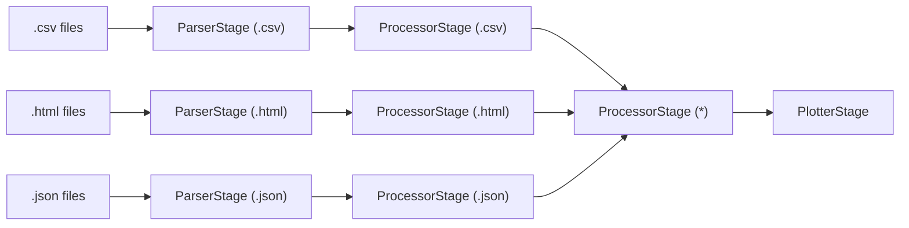

# Pipeline datablock
This page presents the pipeline datablock, an automatically cacheable base datablock with file management built in.

## Why?
The base datablock allows developers to do a lot very freely, but it lacks any structure and requires the developer to
repeat simple actions across datablocks (e.g. caching and file extension checking). This leads to repeated code,
cluttering the codebase with unnecessary calls to check whether the block is `multifile`, has `file_ids` or a `file_id`.

The datablock also has limited promises on what it returns with some returning a plot and other returning an AI chatbot.
The pipeline datablock is meant to remove both the unnecessary clutter from the files and provide developers with more
structure to work with, so they can produce anything from simple to complex datablocks, without worrying about the
underlying datablock or the systems level details.
## How to create a pipeline datablock?
To create a pipeline datablock, one needs two things:
1. An instance of `DataBlockDefaults`, a pydantic model that contains the default parameters for the datablock. Every
field has a default, but the ones you'll usually want to set are: `blocktype`, `name`, `description`,
`accepted_file_extensions`, `multi_file` (whether the block can accept multiple files as input), and `defaults`
(a dict of default values for the block's data, e.g. `{"wavelength": 1.5406}`).
2. A `Pipeline` object for the datablock.

The `Pipeline` consists of four types of `BlockStage`:
1. `ParserStage`: parses a single file (a `pathlib.Path`) and returns a `pd.DataFrame`, or a `(pd.DataFrame, dict)`
tuple if it also wants to update the block's state (see [Advanced functionality](#advanced-functionality)).
2. `ProcessorStage`: processes a `pd.DataFrame` or `list[pd.DataFrame]` (depending on `list_df_input`, see below)
and returns a `pd.DataFrame` or `list[pd.DataFrame]`, optionally paired with a state-update `dict`.
3. `PlotterStage`: turns a `pd.DataFrame` or `list[pd.DataFrame]` into whatever the frontend needs to render a plot
(typically the output of `bokeh.embed.json_item`).
4. `EventStage`: updates the state of the datablock in response to a named frontend event (e.g. a widget changing
value). Unlike the other stages it doesn't operate on a dataframe — it's handed the block's data `dict` directly.

A simple example to create a pipeline datablock that could process `.csv` files would be this:

````python
from pathlib import Path
import pandas as pd
from pydatalab.pipeline_block.pipeline import Pipeline
from pydatalab.pipeline_block import DataBlockDefaults
from pydatalab.pipeline_block.block_stages import ParserStage

def sample_csv_parser(filename: str|Path)->pd.DataFrame:
    return pd.read_csv(filename)

#We only need to supply the parser, since there are default processors and plotters.
example_pipeline: Pipeline = Pipeline(parser=ParserStage(sample_csv_parser, file_extension=".csv"))

block_params: DataBlockDefaults = DataBlockDefaults(
    blocktype="example_csv_parser",
    name="Example CSV Parser",
    description="Parses and plots a standard csv file",
    accepted_file_extensions=(".csv",),
)
CSV_DATABLOCK = {
    "pipeline": example_pipeline,
    "default_params": block_params,
}
````
To connect a new pipeline datablock to the server's `block_manager`, import its dict (e.g. `CSV_DATABLOCK` from
wherever you defined it, following the example above) in `pydatalab/src/pydatalab/apps/__init__.py` and, after the
`block_manager` definition, register it:

````python
from my_module import CSV_DATABLOCK

block_manager.register_block(**CSV_DATABLOCK)
````

### How to create without relying on default stages?
Now the above example relies on the fact that `Pipeline` has a default `ProcessorStage` and a default `PlotterStage`.
If a developer wants to unlock the full functionality of the `Pipeline` for more advanced data processing.
then it is recommended to use custom versions of `ProcessorStage` and `PlotterStage`.
The following is an example of how this can be done for our custom csv parser:

````python
# Only the `Pipeline` definition will be given, to implement this example
# you will also need the block_params from before.
import pandas as pd
from pathlib import Path
from pydatalab.pipeline_block.pipeline import Pipeline
from pydatalab.pipeline_block.block_stages import ParserStage
from pydatalab.pipeline_block.block_stages import ProcessorStage
from pydatalab.pipeline_block.block_stages import PlotterStage
import bokeh.embed


def sample_csv_parser(filename: str | Path) -> pd.DataFrame:
    return pd.read_csv(filename)

def sample_csv_multiplier_by_2(df:pd.DataFrame):
    return df.mul(2)

def sample_plotter(df:pd.DataFrame):
    from pydatalab.bokeh_plots import selectable_axes_plot
    plot = selectable_axes_plot(
        df,
        plot_points=True,
        plot_line=False,
        show_table=True,
    )
    return bokeh.embed.json_item(plot)
example_pipeline: Pipeline = Pipeline(parser=ParserStage(sample_csv_parser, file_extension=".csv"),
                                      processor=ProcessorStage(sample_csv_multiplier_by_2, list_df_input=False),
                                      plotter=PlotterStage(sample_plotter, list_df_input=False))
````

### Adding an event
`EventStage`s are registered separately, via the `events` keyword, keyed by the `event_name` the frontend sends.
For example, to let the user update a `wavelength` value stored on the block:

````python
from pydatalab.pipeline_block.block_stages import EventStage

def set_wavelength(data: dict, wavelength: float):
    data["wavelength"] = float(wavelength)

example_pipeline: Pipeline = Pipeline(
    parser=ParserStage(sample_csv_parser, file_extension=".csv"),
    events={"set_wavelength": EventStage(set_wavelength)},
)
````
A `null_event` is always registered automatically and is a no-op — useful as a placeholder or debug target.

### `list_df_input`
`ProcessorStage` and `PlotterStage` both take a `list_df_input` flag that controls how they're called:
- `list_df_input=False` (the default): the stage function is called **once per dataframe**, and must accept and
return a single `pd.DataFrame`.
- `list_df_input=True`: the stage function is called **once with every dataframe from the previous stage batched
into a `list[pd.DataFrame]`** — useful for e.g. a plotter that overlays multiple files on one plot, or a processor
that needs to see all files at once (useful if there is a calibration file).

Setting this flag to the wrong value is a common source of failures: a stage with `list_df_input=False` will
reject a `list` input (see `validate_input` on `ProcessorStage`/`ParserStage`), which can surface as an empty plot.

### Advanced functionality
All stages apart from the `EventStage` can also return a `dict` (as the second element of a tuple) that will be
merged into the main datablock dictionary and thus update the block state. Two nested keys are treated specially by
the pipeline: `metadata` (e.g. parser-supplied info like `original_filenames`) and `computed` (values derived during
processing); both are reset to `{}` at the start of each pipeline run and populated by stage return values.

Stages can also have parameters named after keys in the datablock state, for example if `"wavelength"`
is stored in the main datablock, then you could have a processor with the definition:
`def wavelength_processor(df: pd.DataFrame, wavelength: float)`
the pipeline would then autopopulate this parameter with the value from the dictionary (e.g. `data["wavelength"]`).
This is done dynamically via introspection, though can also be done manually by specifying what the `accepted_data`
argument of the stage.

**Anything returned in the state dict must be JSON-serializable.** It gets cached to disk via `json.dumps`, so avoid
types like `set` with the suggestion being to use `list`s instead.

### Pipeline complexity
The pipeline functions like a graph created from the parser, processors, and plotters which past in as parameters in the
pipeline `__init__` function, for example the code below:

```python
import pandas as pd
from pathlib import Path
from pydatalab.pipeline_block.pipeline import Pipeline
from pydatalab.pipeline_block.block_stages import ParserStage, ProcessorStage

def sample_csv_parser(filename: str | Path) -> pd.DataFrame:
    return pd.read_csv(filename)


def sample_html_parser(filename: str | Path) -> pd.DataFrame:
    return pd.read_html(filename)[0]

def sample_json_parser(filename: str | Path) -> pd.DataFrame:
    return pd.read_json(filename)
# The processors are just for example and are not meant to be representative of a real world workflow.
def sample_csv_multiplier_by_2(df: pd.DataFrame)->pd.DataFrame:
    return df.mul(2)

def sample_html_multiplier_by_3(df: pd.DataFrame)->pd.DataFrame:
    return df.mul(3)

def  sample_json_multiplier_by_5(df: pd.DataFrame)->pd.DataFrame:
    return df.mul(5)

def sample_combiner(dfs: list[pd.DataFrame])->pd.DataFrame:
    return pd.concat(dfs)

# We rely on the default plotter.
example_pipeline: Pipeline = Pipeline(parser=[ParserStage(sample_csv_parser, file_extension=".csv"),
                                              ParserStage(sample_html_parser, file_extension=".html"),
                                              ParserStage(sample_json_parser, file_extension=".json")],
                                      processor=[
                                          [ProcessorStage(sample_csv_multiplier_by_2, list_df_input=False, file_extension=".csv"),
                                           ProcessorStage(sample_json_multiplier_by_5, list_df_input=False, file_extension=".json"),
                                           ProcessorStage(sample_html_multiplier_by_3, list_df_input=False, file_extension=".html")
                                           ],
                                          [ProcessorStage(sample_combiner, list_df_input=True)]
                                      ],)
```
Would produce the graph shown below:

### Caching
Caching is on by default for parsers and processors though is not currently support by event stages or plotter stages.

Caching can be toggled using the `caching` parameter when initialising a parser or processor stage.
Caching for an entire pipeline can be toggled using the `set_caching_for_entire_pipeline` function which accepts a
`boolean` value (`True`= caching enabled, `False`= caching disabled).

Caching works by creating a hash key based on the:
- upstream cache key
- the passed in parameter values
- the name of the stage (e.g. `Parser` and `Processor`)
- the name of the function the stage runs.

Then the cache key is then passed forward to the next stage along. In the case multiple stages are passed into one stage.
Their cache keys are combined.
### Parser routing when there are multiple parsers
`Pipeline(parser=...)` also accepts a `list[ParserStage]`. When a block is given multiple files, each file is routed
to the **first** registered parser whose `file_extension` matches it — a parser can declare `file_extension="*"` to
accept anything left over. Because matching is first-match-wins, register more specific parsers before any
catch-all/wildcard one, e.g.:

````python
parser=[
    ParserStage(load_excel, file_extension=[".xls", ".xlsx"]),
    ParserStage(load_other, file_extension="*"),  # fallback, must come last
]
````

## Differences compared to normal datablock
### What has not changed?
Pipeline datablocks have some things in common with the standard datablock:
- The same block lifecycle
- The same web API
- A similar event system
### What is different compared to a standard datablock?
Pipeline datablocks are treated on the server level in a very different way. Differences include:
- Pipeline blocks are created and managed via a registry instead of classes like the base pipeline.
- Pipeline block consist of two different parts a set of parameters (`DataBlockDefaults`) and the associated (pipeline)`Pipeline`.
- `routes/v0_1/blocks.py` treats Pipeline datablocks differently compared to standard datablocks. Pipeline datablocks are
treated as dictionaries which are then passed around functions in the `PipelineBlockManager` (`block_manager`).
- Integrated automatic caching.
- Creating pipeline datablocks is completely different (As documented [here](#how-to-create-a-pipeline-datablock)).

## Testing
Test patterns for pipeline datablocks live in `pydatalab/tests/pipeline_block/` — see `test_base_pipeline_block.py`
for end-to-end block behaviour and `test_block_stages.py` for testing individual `ParserStage`/`ProcessorStage`/
`PlotterStage`/`EventStage` instances in isolation without going through the full pipeline.
Ideally if a user wants to add more specialised block stages more tests should be written in `test_block_stages.py`.

## Common problems
- **State returned by any stage must be JSON-serializable** (it's written to the on-disk cache with `json.dumps`).
  Avoid `set`s and other non-JSON types in returned dicts.
- **Get `list_df_input` right on every `ProcessorStage`/`PlotterStage`.** A mismatch between what a stage expects and
  what it receives fails `validate_input` silently and shows up as an empty plot, not a clear error.
- **Order matters when registering multiple parsers.** A wildcard (`"*"`) parser registered before a more specific
  one will steal files that should have gone to the specific parser.
