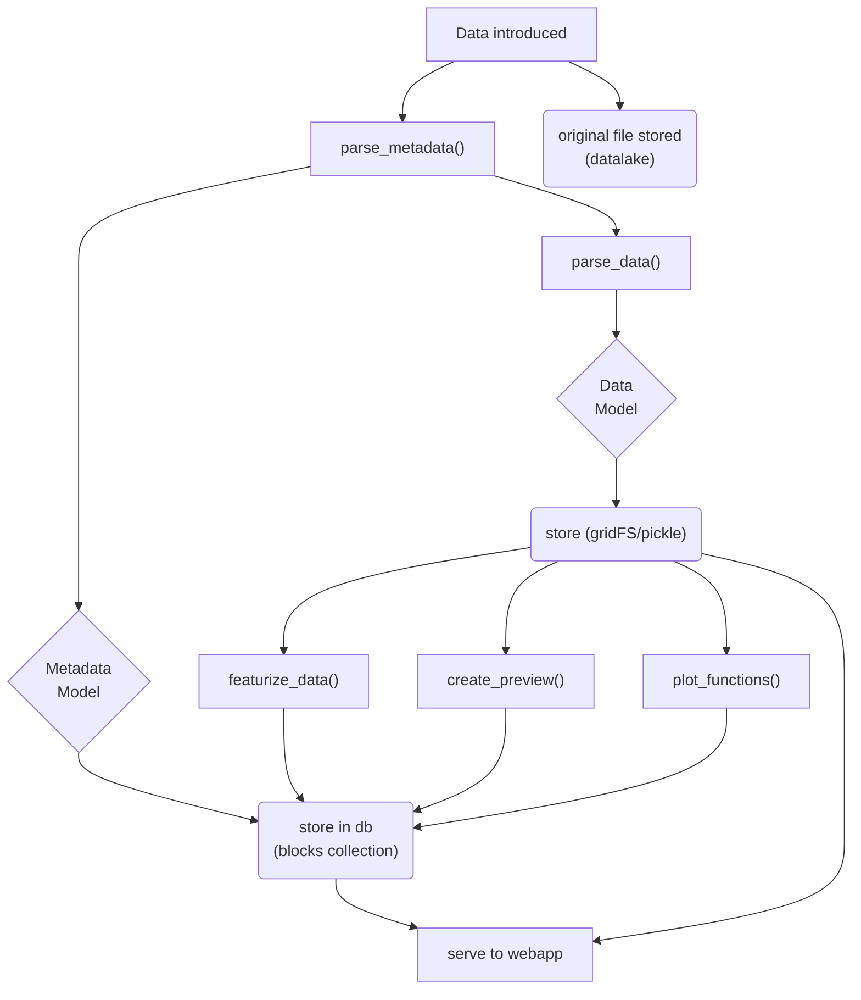

# Draft design: Data lifecycle

Here is a current idea for how data should flow through a datablock.

```mermaid
graph
    A[Data introduced] --> B["parse_metadata()"]
    A --> L("original file stored \n(datalake)")
    B --> B2{"Metadata\nModel"}
    B --> D["parse_data()"]
    B2 --> X("store in db \n(blocks collection) ")
    D --> D2{"Data\nModel"}
    D2 --> E("store (gridFS/pickle)")
    E --> F["featurize_data()"] --> X
    E --> G["create_preview()"] --> X
    E --> H["plot_functions()"] --> X
    X --> Z["serve to webapp"]
    E --> Z
```
