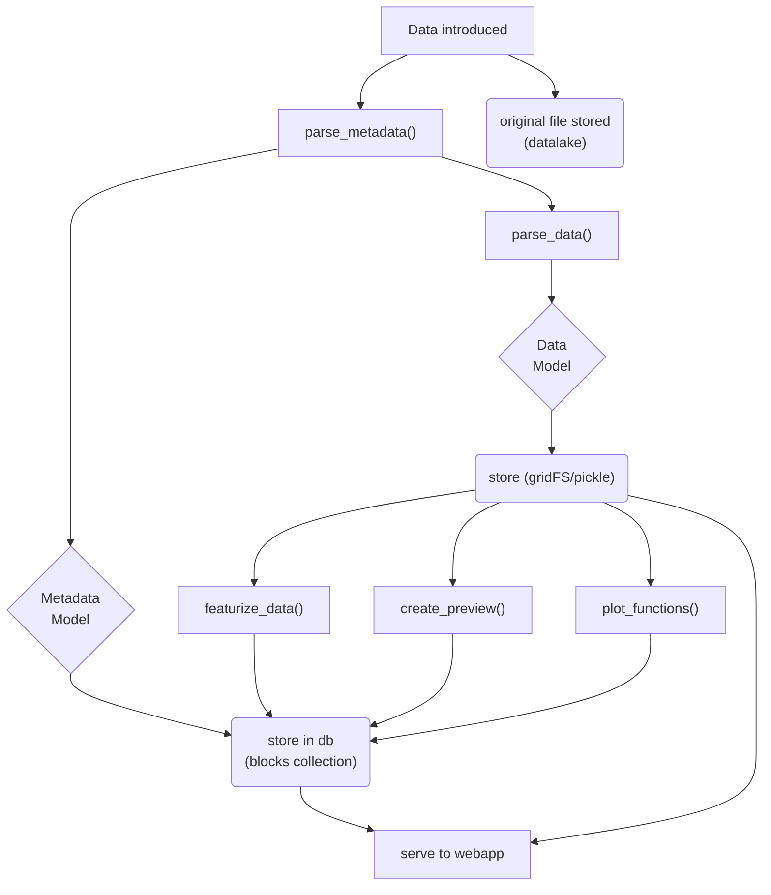

# Draft design: Data block lifecycle

Here is a current idea for how data should flow through a datablock.
The main design constraint is that it should be possible for non-expert
developers to easily define a new block that can parse and display valid data,
returning errors where appropriate.

In the best case scenario, this would mean that the block developer should not
need to write any Javascript, Bokeh or pydantic code, unless they want to do
something more advanced.

The default data model and set of hooks must then be sufficient to encapsulate
simple use cases, in order of priority:

1. Provided a single file from the UI, perform an operation on the file, store
  the result and create a plot to be shown in the UI.
2. Provided multiple files from the UI, parse them according to some rule and
   create a plot to be shown in the UI.
3. Provided multiple blocks or data entries, create a comparative plot.

