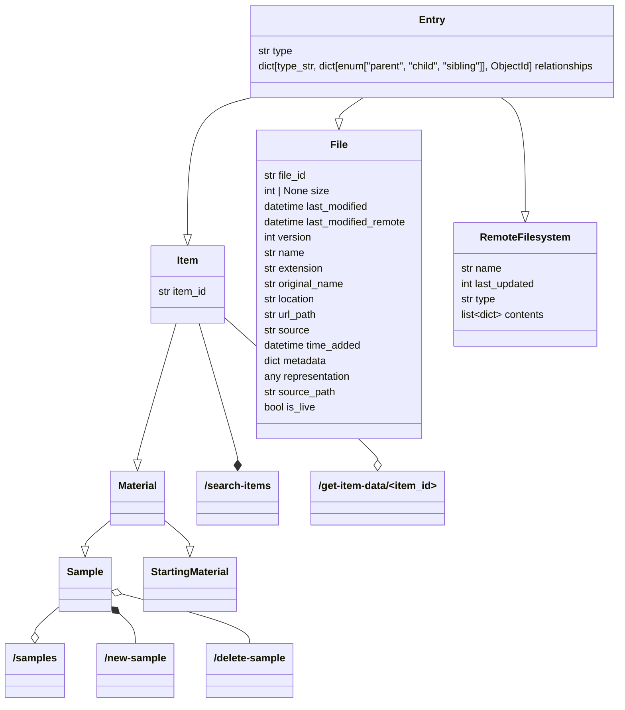

# Draft design: Model hierarchy

```mermaid
classDiagram
Entry --|> Item
Entry: str type
Entry --|> File
Entry: dict[type_str, dict[enum["parent", "child", "sibling"]], ObjectId] relationships
class File {
    str file_id
    int | None size
    datetime last_modified
    datetime last_modified_remote
    int version
    str name
    str extension
    str original_name
    str location
    str url_path
    str source
    datetime time_added
    dict metadata
    any representation
    str source_path
    bool is_live
}
class RemoteFilesystem {
    str name
    int last_updated
    str type
    list~dict~ contents
}
Entry --|> RemoteFilesystem
Material --|> Sample
Material --|> StartingMaterial
Item --|> Material
Sample --o `/samples`
Item --* `/search-items`
Sample *-- `/new-sample`
Sample o-- `/delete-sample`
class `/delete-sample`:::route
class `/search-items`:::route
class `/samples`:::route
class `/new-sample`:::route
class `/get-item-data/~item_id~`:::route
Item --o `/get-item-data/~item_id~`
Item: str item_id
```
