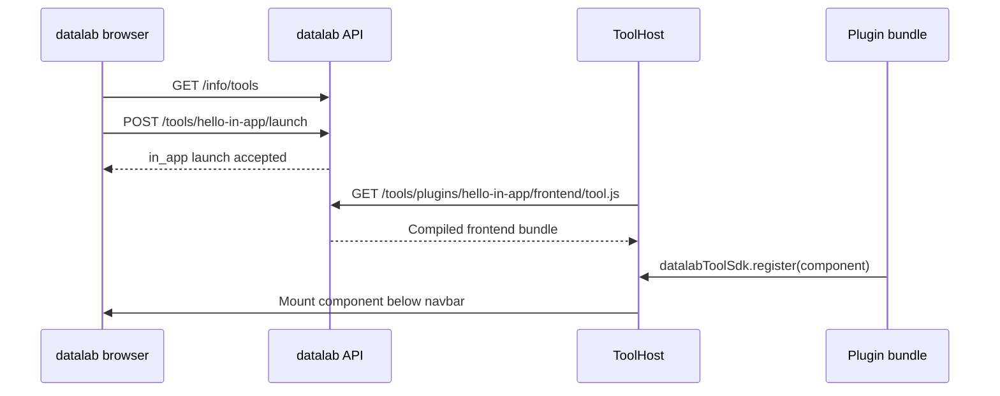
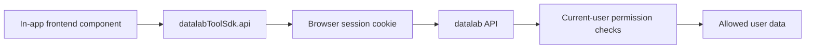

# Developing an in-app Tool plugin

This tutorial follows the
[in-app example plugin](https://github.com/Matgenix/datalab-in-app-tool-plugin-example),
a minimal tool that renders inside datalab and prints one message using the
frontend SDK.

## Level 1: layman's overview

The *in-app tool* is more like adding a trusted panel to the datalab webapp than
opening a separate application. datalab loads the plugin's compiled JavaScript
bundle, mounts its frontend component below the normal navigation bar, and gives it
the frontend SDK. The provider's default browser policy automatically protects
the bundle route.



The example displays one sentence: `Hello <user>. You can access <N> sample(s).`

## Level 2: create and inspect the plugin

The example is equivalent to generating an in-app package from the *Copier*
template:

```shell
uvx copier copy https://github.com/Matgenix/datalab-tool-plugin-template \
  datalab-in-app-tool-plugin-example
```

Use these answers:

```text
tool_name = Hello in-app
tool_id = hello-in-app
distribution_name = datalab-hello-in-app-tool
tool_ui_kind = in-app
tool_open_mode = same_tab
add_item_table_action = false
```

The important files are:

| File | Purpose |
|---|---|
| `pyproject.toml` | Declares the package and `pydatalab.tools` entry point |
| `src/datalab_hello_in_app_tool/provider.py` | Registers metadata and serves the *compiled frontend bundle* |
| `frontend/src/main.js` | Registers the component with `datalabToolSdk` |
| `frontend/src/ToolView.vue` | Calls the SDK and renders one sentence |
| `src/datalab_hello_in_app_tool/static/frontend/tool.js` | Built bundle served to datalab |

The provider advertises an *in-app tool*:

```python
metadata = ToolMetadata(
    name="Hello in-app",
    ui=InAppToolUI(),
)
```

The default provider `launch()` is sufficient for an in-app tool.

The frontend registers itself with the SDK:

```javascript
window.datalabToolSdk.register(ToolView);
```

### Optional: open from an item table

The Hello World keeps `add_item_table_action = false`, so it appears only in
the Tools interfaces. An in-app tool that operates on selected rows can answer
`true` instead. *Copier* then asks for an action ID, label, *stable table
identifiers*, and minimum/maximum selection size, and generates metadata such
as:

```python
launch_actions=(
    ItemTableSelectionAction(
        id="open-selected",
        label="Open selected",
        tables=("samples",),
        min_items=1,
        max_items=10,
    ),
)
```

The generated Vue component reads the standard *selection query parameters*:

```javascript
const { actionId, itemRefcodes } = sdk.selection.current();
```

Only ordered immutable *item refcodes* are passed. Fetch current item data
through the normal *permission-aware API*, because URL input never proves that
the current user may access an item.

## Level 3: access and trust model

An in-app plugin does not exchange a *launch code* for a *tool access token*. It is
already running inside the signed-in datalab web application, so it uses the SDK
API helpers:

```javascript
const [currentUser, sampleResponse] = await Promise.all([
  sdk.api.get("/get-current-user/"),
  sdk.api.get("/samples/"),
]);
```

Those helpers call datalab with the normal *browser session*. Existing datalab
permissions still apply, but the plugin JavaScript is trusted code executing in
the user's page. A deployment administrator must review the source, dependencies
and built bundle before installing or updating the plugin.

The example intentionally has no custom data route: ordinary *in-app tools*
should begin with the SDK and permission-aware core API. A plugin that needs a
server-side analysis route may add it to the same protected blueprint, but any
direct *item* or database lookup must still apply object-level datalab
permissions.



## Build, install and run

Build the frontend bundle:

```shell
cd datalab-in-app-tool-plugin-example/frontend
yarn install
yarn build
```

Add the plugin to the root `plugins.toml`:

```toml
dependencies = ["datalab-hello-in-app-tool"]

[tool.uv.sources]
datalab-hello-in-app-tool = { path = "../datalab-in-app-tool-plugin-example", editable = true }
```

Install the plugin into the datalab environment:

```shell
cd pydatalab
uv run invoke dev.install
```

For Docker Compose development, rebuild the API image after adding the plugin:

```shell
docker compose --profile dev up --build
```

Open datalab, hover or click **Tools**, and choose **Hello in-app**. It will
open at `/tools/hello-in-app` with the normal datalab navigation still visible.

## Common errors

| Symptom | Likely cause |
|---|---|
| Tool does not appear | The package is not installed, the entry point did not load, or the API server was not restarted |
| Tool page says the module could not be loaded | The built `static/frontend/tool.js` file is missing or the frontend route returned 401 |
| SDK version error | The plugin bundle was built for a different frontend SDK version |
