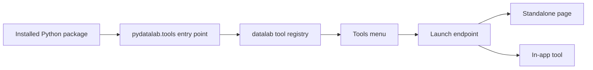
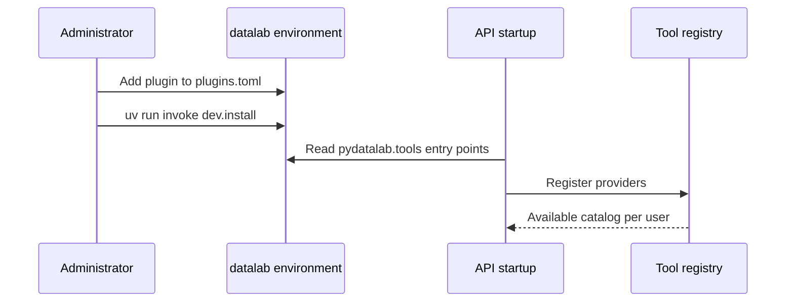
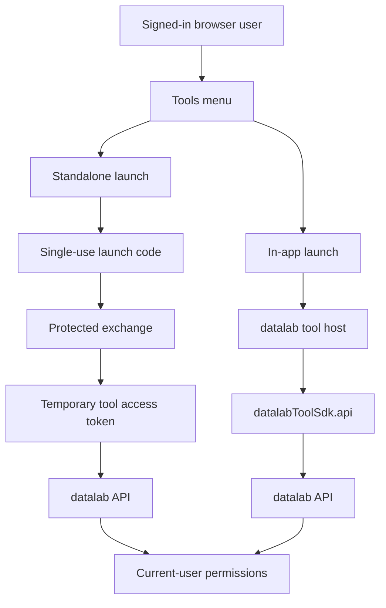

# Plugin development tutorials

These tutorials introduce the two supported tool UI types with small
"Hello World" examples:

- [Developing a standalone Tool plugin](standalone-tool-plugin.md) opens in a
  new tab and uses a temporary tool access token.
- [Developing an in-app Tool plugin](in-app-tool-plugin.md) renders below the
  normal datalab navigation and uses the frontend SDK.

Both examples follow the packages generated by the
[datalab tool plugin template](https://github.com/Matgenix/datalab-tool-plugin-template).
Their intended standalone repositories are:

- [datalab standalone tool plugin example](https://github.com/Matgenix/datalab-standalone-tool-plugin-example)
- [datalab in-app tool plugin example](https://github.com/Matgenix/datalab-in-app-tool-plugin-example)

The [datalab-jupyter](https://github.com/Matgenix/datalab-jupyter) companion
component is a larger standalone example: its concrete provider is discovered
through the same entry-point mechanism while its Hub and user-server modules
are installed only in the processes that need them.

datalab automatically authenticates every route in a plugin's declared
blueprint. The examples therefore need no repeated login decorator.
Authentication protects entry to the route; normal API calls apply
current-user item permissions.

!!! warning "Trusted plugin code"
    Tool plugins are installed by a deployment administrator and run as trusted
    code. Provider Python runs in the datalab API process. An in-app frontend
    bundle also runs JavaScript inside the signed-in user's datalab page.
    Review the source, dependencies, and compiled assets before installation.

## Level 1: the map

In plain terms, a tool plugin is a Python package that tells datalab: "I am a
tool, here is my name, and here is how to open me."

| UI type | Where the UI runs | How it calls datalab |
|---|---|---|
| Standalone | A separate page or service | A temporary tool access token |
| In-app | Inside the datalab webapp | The SDK and normal browser session |

## Level 2: discovery

Each package declares a `pydatalab.tools` entry point in `pyproject.toml`.
datalab discovers those entry points when the API starts. A provider that loads
successfully and is not disabled by configuration appears in the current
user's tool catalog.

## Level 3: current-user access

The two examples deliberately use different access paths.

A temporary tool access token is a real current-user API credential. It is
short-lived and tool-bound, but must still be kept out of URLs, browser
storage, notebooks, persistent files, and logs.

Routes hosted by a separate tool service are outside datalab's automatic
blueprint protection. Their operator must authenticate the application and use
the temporary credential only through datalab's normal API.
