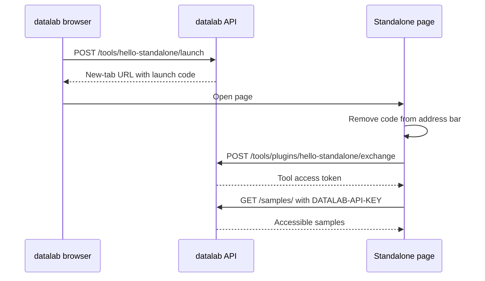

# Developing a standalone Tool plugin

This tutorial follows the
[standalone example plugin](https://github.com/Matgenix/datalab-standalone-tool-plugin-example),
a minimal tool that opens in a new tab and prints one message using datalab
data.

## Level 1: layman's overview

The *standalone tool* is like giving a visitor a short-lived badge at reception.
datalab checks that the user is signed in, creates a *launch code*, and
opens the tool page with that code. The tool immediately trades the code for a
*tool access token* and uses that token to ask datalab for data.
The framework automatically protects the page and exchange routes with the
active browser-session policy.
The example uses plain HTML so the access flow is visible. A real standalone
tool can replace `index.html` with any reviewed web app or remote service.



The example displays one sentence: `Hello <user>. You can access <N> sample(s).`

## Level 2: create and inspect the plugin

The example is equivalent to generating a standalone package from the *Copier*
template:

```shell
uvx copier copy https://github.com/Matgenix/datalab-tool-plugin-template \
  datalab-standalone-tool-plugin-example
```

Use these answers:

```text
tool_name = Hello standalone
tool_id = hello-standalone
distribution_name = datalab-hello-standalone-tool
tool_ui_kind = standalone
tool_open_mode = new_tab
```

The important files are:

| File | Purpose |
|---|---|
| `pyproject.toml` | Declares the package and `pydatalab.tools` entry point |
| `src/datalab_hello_standalone_tool/provider.py` | Registers metadata, serves the page, launches the tool, and exchanges codes |
| `src/datalab_hello_standalone_tool/static/index.html` | Exchanges the code, calls `/samples/`, and writes one sentence |

The provider advertises a standalone UI:

```python
metadata = ToolMetadata(
    name="Hello standalone",
    ui=StandaloneToolUI(),
)
```

Its `launch()` method issues a *tool launch grant*:

```python
code = grants.issue(TOOL_ID)
return f"{base_url}index.html#datalab_launch_code={code}"
```

The exchange route consumes the code for the same browser user:

```python
result = exchange_launch_code(
    code,
    TOOL_ID,
    TOOL_ID,
    expected_user_id=str(current_user.person.immutable_id),
)
```

There is no login helper or decorator in this provider. Because its blueprint
uses the default `ToolRouteAuth.BROWSER` policy, datalab authenticates every
route before calling it and rejects *tool access token* issuance requests from untrusted
origins. `expected_user_id` separately ensures that the *tool launch grant* belongs to
that authenticated browser user.

## Level 3: access details

The *launch code* and *tool access token* are different objects:

| Value | Lifetime | Who sees it | What it can do |
|---|---|---|---|
| *Launch code* | About 60 seconds, single use | The launched tool page | Can be exchanged once |
| *Tool access token* | About 24 hours by default | The trusted tool page or backend | Authenticates API calls as the *current user* |

The page removes the *launch code* from the URL before doing anything else:

```javascript
launchUrl.hash = "";
window.history.replaceState({}, "", launchUrl);
```

That prevents the *launch code* from being copied, bookmarked, leaked through
screenshots, or left in browser history. The *tool access token* is kept in memory and
sent only in API request headers:

```javascript
fetch(`${apiPrefix}/samples/`, {
  credentials: "omit",
  headers: { "DATALAB-API-KEY": exchange.tool_access_token },
});
```

Do not store *tool access tokens* in local storage, session storage, notebooks,
persistent files, URLs, analytics, or logs. The token is short-lived, but while
it is valid it carries the user's normal datalab permissions.

## Install and run

Add the plugin to the root `plugins.toml`:

```toml
dependencies = ["datalab-hello-standalone-tool"]

[tool.uv.sources]
datalab-hello-standalone-tool = { path = "../datalab-standalone-tool-plugin-example", editable = true }
```

Install the plugin into the datalab environment:

```shell
cd pydatalab
uv run invoke dev.install
```

For Docker Compose development, rebuild the API image after adding the plugin:

```shell
docker compose --profile dev up --build
```

Open datalab, hover or click **Tools**, and choose **Hello standalone**.

## Common errors

| Symptom | Likely cause |
|---|---|
| Tool does not appear | The package is not installed, the entry point did not load, or the API server was not restarted |
| `Invalid or expired launch code` | The page was refreshed after the code was consumed, or launch took longer than the *tool launch grant lifetime* |
| `Authentication required` | The route was called without a datalab *browser session* |
| `A browser session is required` | The caller used an inactive account, permanent key, or *tool access token* instead of the *browser session* |
| `Untrusted request origin` | The exchange request did not come from the configured datalab frontend/API origin |
